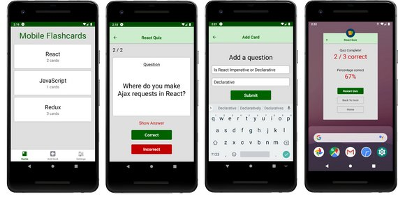

# Mobile Flashcards

Mobile Flashcards is a React Native application that allows users to create decks, add cards and test themselves.



It uses React Native, Expo, Redux, & React Navigation.

## Installation

Clone the repository, change directories, and use npm or yarn to install the dependencies.

```bash
$ git clone https://github.com/burakkutluk/flashcards-mobile-app.git
$ cd flashcards-mobile-app
$ yarn
```

## Usage

The project can be run with npm or yarn

- `yarn start`
